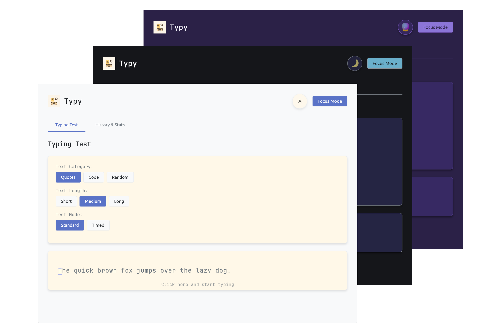

# Typy

A light typing test game made to improve at typing speed.

  

## Features

### Multiple Test Modes
- *Standard Mode*
- *Timed Mode* (15s, 30s, or 60s)

### Customizable Experience
- Three themes: *Light*, *Dark*, and *Purple*
- Adjustable font size
- *Focus mode*: Hide distractions

### Comprehensive Statistics
- Words per minute (WPM)
- Accuracy percentage
- Character-by-character feedback
- Historical performance tracking

### Test Options
- Text categories: *Quotes*, `Code`, **Random**
- Text lengths: Short, Medium, Long
- Time limits for timed mode: 15s / 30s / 60s

## How to Play

1. Select Your Test Settings
- Choose a text category and length
- Pick a test mode and a time limit (if applicable)

2. Start Typing
- Click the typing area or start typing
- The current character to type is highlighted

3. Review Your Results
- View WPM, accuracy, and character errors
- Check the *History & Stats* tab to track your progress

## Screenshots

### Typing Test

  

### Test Results

  

### History & Stats

  

### Test Settings

  

## Future Improvements

- Add support for custom text input
- More themes and customization options
- UI/UX enhancements

## License

MIT License

---

This game was made by [superflash41](github.com/superflash41) using Rust.