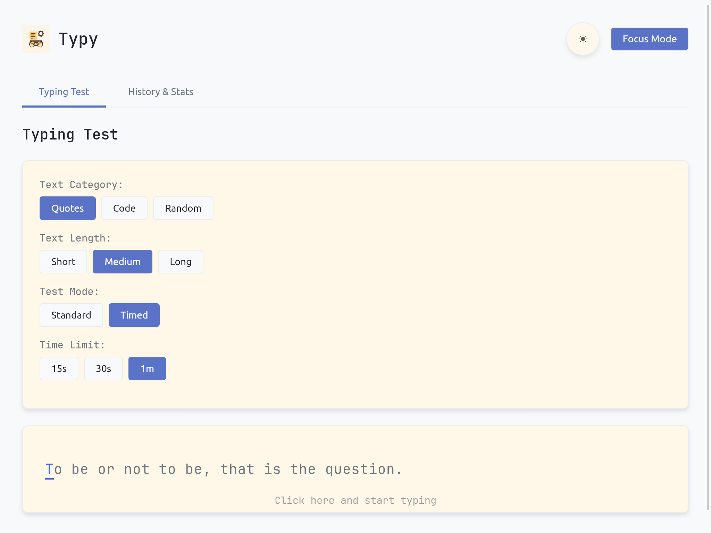

# Typy

A light typing test game made to improve at typing speed.

  

## Features

- Multiple Test Modes: *Standard Mode* and *Timed Mode* (15s, 30s, or 60s)

- Customizable Experience: three themes, adjustable font size and *Focus mode* support

- Statistics: WPM, accuracy, historical performance tracking

- Test Options: text categories (*Quotes*, `Code`, **Random**) and different length options

## How to Play

1. Select Your *Test Settings*
- Choose a text category and length
- Pick a test mode and a time limit (if applicable)

2. Start Typing
- Click the typing area or start typing
- The current character to type is highlighted

3. Review Your Results
- View WPM, accuracy, and character errors
- Check the *History & Stats* tab to track your progress

## Screenshots

  

  

  

## Future Improvements

- Add support for custom text input
- More themes and customization options
- UI/UX enhancements

## License

This project is licensed under the MIT License. See [LICENSE](LICENSE) for details.

---

This game was made by [superflash41](https://github.com/superflash41) using Rust.

  

